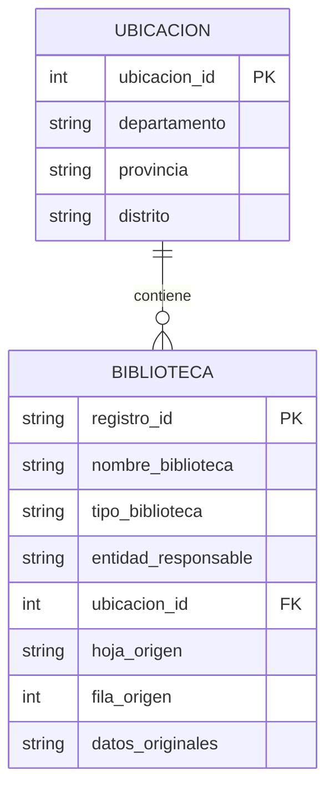
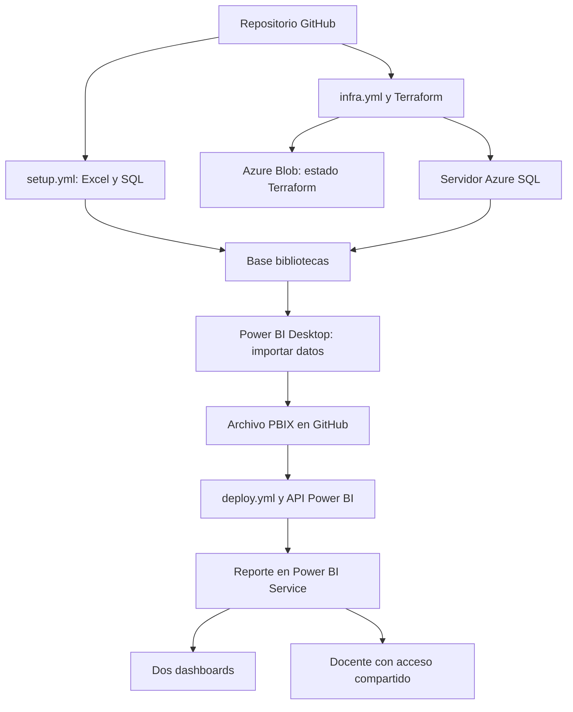

# Análisis de bibliotecas públicas y universitarias del Perú

Proyecto de Inteligencia de Negocios sobre el Registro Nacional de Bibliotecas (RNB), con una base Azure SQL, infraestructura con Terraform y publicación de un reporte Power BI mediante GitHub Actions.

## Estado de la entrega

Este repositorio contiene los scripts y automatizaciones. Antes de entregarlo al profesor deben incorporarse el Excel oficial, su mapeo, el SQL de carga generado y el archivo `powerbi/bibliotecas.pbix`, ejecutar los tres workflows y completar las URLs. No se incluyen datos ficticios ni se afirma que exista una publicación realizada.

- Repositorio: **PENDIENTE: URL real de GitHub**
- Reporte: **PENDIENTE: URL real de Power BI obtenida en deploy.yml**
- Dashboard 1: **PENDIENTE: URL de Registro nacional**
- Dashboard 2: **PENDIENTE: URL de Distribución territorial**
- Acceso del docente: **PENDIENTE: verificar correo del enunciado y compartir desde Power BI**

## Dataset

Fuente: Biblioteca Nacional del Perú, [Bibliotecas públicas y universitarias verificadas en el Registro Nacional de Bibliotecas](https://www.datosabiertos.gob.pe/dataset/bibliotecas-p%C3%BAblicas-y-universitarias-verificadas-en-el-registro-nacional-de-bibliotecas-%E2%80%93).

La ficha consultada el 1 de octubre de 2026 describe un recurso Excel con cobertura de 2019 a 2025 y datos de bibliotecas, entidades responsables, infraestructura, servicios y materiales. La ficha muestra una modificación del 21 de septiembre de 2026. La licencia figura como no especificada.

Se seleccionan las variables descriptivas y geográficas necesarias para un reporte sencillo. Los encabezados reales se establecen en `data/mapping.json` después de inspeccionar el Excel; no se asume que coincidan con los nombres SQL. Se preservan las demás columnas de cada fila como JSON. El archivo `data/provenance.json`, generado durante la preparación, registra hoja, encabezados, SHA-256, total de registros y total de ubicaciones de la versión efectivamente usada.

La unidad de análisis es **una fila de la hoja seleccionada**. No se considera que todas las filas correspondan a bibliotecas distintas: el recurso puede contener repeticiones o cortes temporales. Los indicadores se presentan como conteos de registros. El análisis describe el archivo y no mide acceso de toda la población ni demuestra causalidad.

## Diccionario del modelo de datos

Este diccionario documenta el modelo implementado. El diccionario original de la BNP debe descargarse del portal y conservarse en `docs/` si se necesita documentar todas las variables de origen.

| Tabla | Campo | Tipo | Descripción |
|---|---|---|---|
| ubicacion | ubicacion_id | INT, PK | Identificador generado de la combinación geográfica |
| ubicacion | departamento | NVARCHAR(150) | Valor de origen, o Sin dato cuando está vacío |
| ubicacion | provincia | NVARCHAR(150) | Valor de origen, o Sin dato cuando está vacío |
| ubicacion | distrito | NVARCHAR(150) | Valor de origen, o Sin dato cuando está vacío |
| biblioteca | registro_id | CHAR(64), PK | SHA-256 derivado del archivo, hoja y fila; identifica el registro |
| biblioteca | nombre_biblioteca | NVARCHAR(500) | Nombre de origen; obligatorio |
| biblioteca | tipo_biblioteca | NVARCHAR(250) | Categoría original, sin reclasificar; Sin dato si está vacía |
| biblioteca | entidad_responsable | NVARCHAR(500), NULL | Entidad responsable, cuando el archivo la incluye |
| biblioteca | ubicacion_id | INT, FK | Relación con la ubicación |
| biblioteca | hoja_origen | NVARCHAR(128) | Hoja del Excel utilizada |
| biblioteca | fila_origen | INT | Número de fila del Excel para trazabilidad |
| biblioteca | datos_originales | NVARCHAR(MAX), JSON | Todas las columnas con encabezado de esa fila |

La vista `dbo.vw_bibliotecas` combina las dos tablas para facilitar la importación en Power BI. La tabla llamada biblioteca conserva registros; su clave no representa un identificador oficial del RNB.

## Diagrama entidad-relación

## Despliegue e infraestructura

- Terraform administra el grupo `rg-bnp-<sufijo>` y el servidor `sql-bnp-<sufijo>` en `eastus`.
- El backend se conserva en `rg-bnp-state-<sufijo>`, cuenta `stbnp<sufijo>`, contenedor privado `tfstate`; el workflow lo prepara automáticamente con Azure CLI. No depende del disco temporal del runner.
- `setup.yml` crea la base `bibliotecas` en nivel Basic con Azure CLI, crea tablas y carga el archivo. Usa SQL directo; Liquibase se omite porque es una preferencia en el enunciado, no un requisito obligatorio.
- El acceso del runner a SQL se abre para su IP y se cierra al finalizar el job. Desktop necesita una regla para la IP del estudiante. La conexión usa TLS y valida el certificado.
- `deploy.yml` importa el PBIX por REST API y espera hasta confirmar que la importación terminó correctamente. Genera una URL en el resumen del job.
- El PBIX contiene una instantánea importada; publicar no actualiza por sí solo los datos desde SQL. Para esta entrega, actualizar en Desktop, guardar y subir de nuevo. Un refresco programado requeriría configurar además las credenciales y conectividad del modelo en Service.

## Archivos principales

| Requisito | Implementación | Evidencia final |
|---|---|---|
| Creación y carga SQL | sql/01_create_tables.sql y sql/02_load_data.sql | INSERT reales generados y subidos a GitHub |
| Servidor con Terraform | infra/ y .github/workflows/infra.yml | Ejecución verde y servidor Azure |
| Base, tablas y carga automatizadas | .github/workflows/setup.yml | Ejecución verde y conteo verificado |
| Power BI: dos dashboards y tabla con filtro | powerbi/bibliotecas.pbix y docs/POWER_BI.md | PBIX real, reporte y dos dashboards en Service |
| Publicación automatizada | .github/workflows/deploy.yml | Ejecución verde y URL de reporte |
| Documentación | README.md | Dataset, diccionario y diagramas |

## Cómo ejecutarlo

Seguir [PASO_A_PASO.md](docs/PASO_A_PASO.md) y [POWER_BI.md](docs/POWER_BI.md). Orden: preparar Excel → subir código → configurar cuentas y secretos → infra.yml → setup.yml → crear PBIX → deploy.yml → crear dashboards → compartir → completar URLs.

## Costes y límites

Azure SQL Basic y el almacenamiento del estado pueden generar cargos. Revisar el coste en la suscripción y no asumir que los créditos estudiantiles cubren cualquier servicio. Power BI Desktop es gratuito; publicar en un workspace compartido y compartir depende de las licencias y permisos de la institución. Confirmar la disponibilidad de Power BI Pro o la capacidad adecuada y el permiso de administrador para la API antes de desplegar.

No subir credenciales ni archivos de estado Terraform. Los secretos se configuran en GitHub. El estado remoto contiene datos sensibles y su almacenamiento debe permanecer privado. Los scripts de carga reemplazan la instantánea de estas dos tablas, por lo que esta base debe dedicarse exclusivamente al proyecto.

## Referencias

- [Dataset oficial BNP](https://www.datosabiertos.gob.pe/dataset/bibliotecas-p%C3%BAblicas-y-universitarias-verificadas-en-el-registro-nacional-de-bibliotecas-%E2%80%93)
- [Recurso SQL Server de AzureRM](https://registry.terraform.io/providers/hashicorp/azurerm/latest/docs/resources/mssql_server)
- [Estado remoto azurerm](https://developer.hashicorp.com/terraform/language/backend/azurerm)
- [API de importación de Power BI](https://learn.microsoft.com/en-us/rest/api/power-bi/imports/post-import-in-group)
- [Acceso mediante aplicación de Microsoft Entra](https://learn.microsoft.com/en-us/power-bi/developer/embedded/embed-service-principal)
- [Crear dashboards](https://learn.microsoft.com/en-us/power-bi/create-reports/service-dashboard-create)
- [Compartir reportes](https://learn.microsoft.com/en-us/power-bi/collaborate-share/service-how-to-collaborate-distribute-dashboards-reports)
